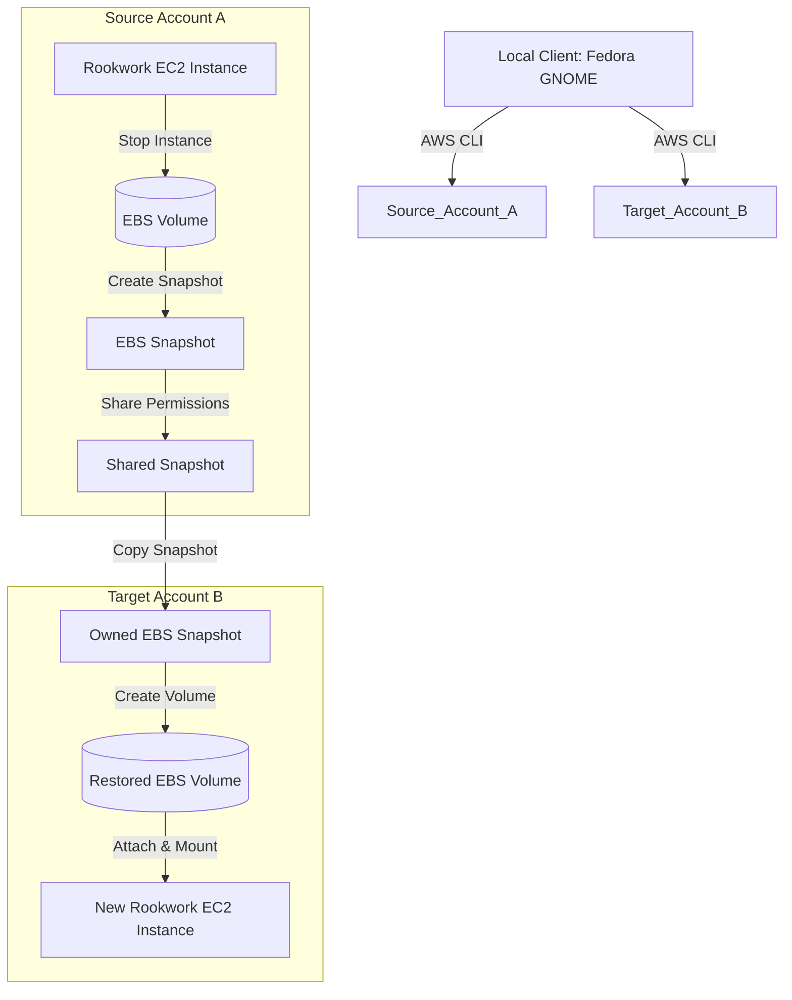

#### About Amazon EBS Snapshot

**Amazon Elastic Block Store (EBS) Snapshots** provide block-level, incremental backups of your EBS volumes. 

In this lab, we will leverage Cross-Account Snapshot Sharing to copy the storage drive data of the **Rookwork** application server from the Source account to the Target account. This helps to:
- Securely back up application data outside the primary account.
- Fast-migrate application servers (Database, Uploaded Files) to a different environment without risking data inconsistency.

#### Migration Architecture

The operational workflow of the migration process is as follows:
1. **Source Account (Account A)**: Contains the running Rookwork application EC2 instance, attached to an EBS Volume hosting the databases and source files.
2. **Create Snapshot**: Stop the EC2 instance to ensure file system consistency (consistent snapshot), then create an EBS Snapshot of the volume.
3. **Share Snapshot**: Grant access permissions allowing the Target Account (Account B) to read the created Snapshot.
4. **Target Account (Account B)**: Copy the shared Snapshot into Account B to transfer ownership.
5. **Restore Volume & Launch**: Create a new EBS Volume from the copied Snapshot and attach it to a new EC2 instance in Account B to restart Rookwork.

#### Step-by-Step Sequence Flow (AWS Official Workflow):

