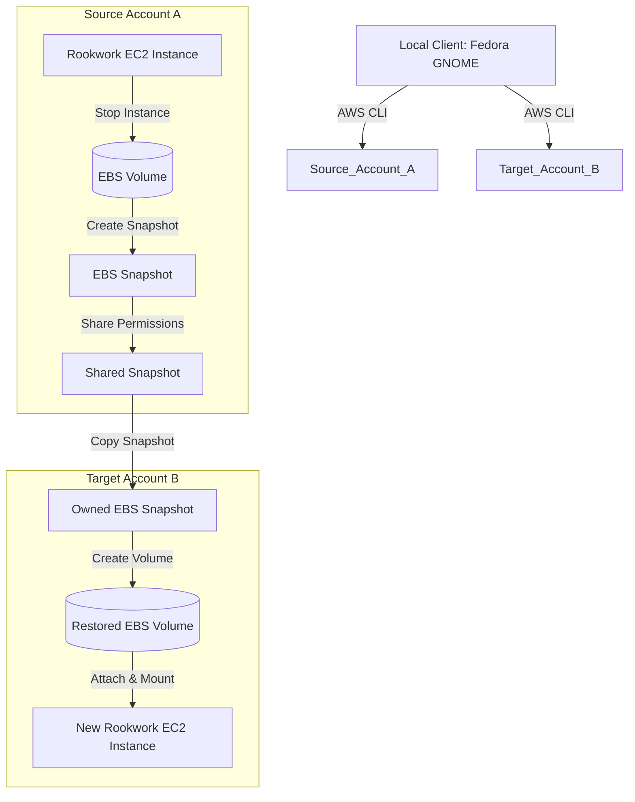

#### Giới thiệu về Amazon EBS Snapshot

**Amazon Elastic Block Store (EBS) Snapshots** là phương pháp sao lưu dạng block-level, có tính chất lũy kế (incremental backup) của các EBS volume. 

Trong bài lab này, chúng ta sẽ tận dụng khả năng chia sẻ snapshot giữa các tài khoản AWS (Cross-Account Snapshot Sharing) để sao sao chép dữ liệu đĩa cứng của máy chủ chạy ứng dụng **Rookwork** từ tài khoản Source sang tài khoản Target. Điều này giúp:
- Sao lưu dự phòng dữ liệu ứng dụng một cách an toàn ngoài tài khoản gốc.
- Di chuyển máy chủ ứng dụng (Database, Uploaded Files) nhanh chóng sang môi trường khác mà không làm mất tính nhất quán của dữ liệu.

#### Kiến trúc di chuyển (Migration Architecture)

Mô hình hoạt động của quy trình di chuyển như sau:
1. **Source Account (Tài khoản A)**: Chứa máy chủ ứng dụng Rookwork chạy trên EC2 instance, gắn EBS Volume lưu trữ database và mã nguồn.
2. **Tạo Snapshot**: Tiến hành dừng EC2 instance để đảm bảo tính nhất quán dữ liệu (consistent snapshot), sau đó tạo EBS Snapshot từ EBS Volume này.
3. **Chia sẻ Snapshot**: Thiết lập quyền truy cập cho phép Target Account (Tài khoản B) đọc được Snapshot vừa tạo.
4. **Target Account (Tài khoản B)**: Thực hiện sao chép (copy) Snapshot đã được chia sẻ về tài khoản của mình nhằm chuyển quyền sở hữu (owner).
5. **Khôi phục Volume & Khởi chạy**: Tạo một EBS Volume mới từ bản sao Snapshot và gắn vào máy chủ EC2 mới trong tài khoản B để tiếp tục vận hành Rookwork.

#### Sơ đồ trình tự các bước thực hiện (AWS Official Workflow):

